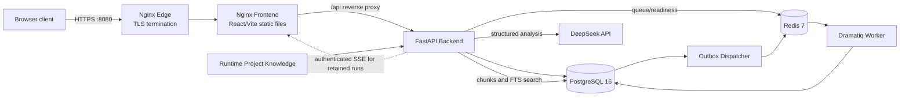

# Personal Job Agent

Personal Job Agent is a private, evidence-grounded workspace for comparing a
Resume with a Job Description (JD). It combines saved Resume management,
DeepSeek-assisted analysis, deterministic scoring, Project Knowledge retrieval,
History, and operational monitoring in one authenticated web application.

The product prepares analysis for human review. It does not submit job
applications, contact employers, or guarantee an Applicant Tracking System
(ATS) outcome.

## Current Version

| Item | Current state |
| --- | --- |
| Stable release | **2.0.3** — Resilient Analysis and Primary Resume Upload |
| Production schema | Alembic `20260721_05` (`head`) |
| Production database | PostgreSQL 16 |
| Runtime topology | HTTPS Edge, Frontend, Backend, PostgreSQL, Redis, Worker, and Outbox Dispatcher |

Version 2.0.3 makes model-output handling tolerant of common formatting defects,
allows at most one format-only repair call, and returns a deterministic local
fallback when the provider or response is unusable. It also adds safe Resume
upload, automatic Primary Resume selection, and Analyze-page Primary Resume
loading. The migration is additive: it adds `resumes.is_primary`, backfills the
newest active Resume per user, and keeps existing Resume and Resume Version data.

See the [Version 2.0.3 release notes](docs/V2_0_3_RELEASE_NOTES.md) for upgrade
and rollback details.

## Core Features

- Administrator-created accounts with Argon2 password hashing, opaque
  server-side Sessions, Remember Me, and Account controls.
- Career Profile data with revision-aware editing and user ownership checks.
- Resume Library with immutable Resume Versions and private File Assets.
- Resume-page upload and text extraction for PDF, DOCX, TXT, MD, and Markdown.
- Automatic Primary Resume selection after every successful Resume-page upload.
- Analyze-page automatic loading of the Primary Resume, with a request-only
  saved Resume Version or PDF/DOCX upload override.
- Resume-to-JD analysis from pasted text or one safely fetched HTTPS job URL.
- Optional Project Knowledge Retrieval-Augmented Generation (RAG), deterministic
  scoring, evidence mapping, warnings, and safe source metadata.
- Stable `complete`, `repaired`, `partial`, and `fallback` analysis results.
- Optional History persistence, History detail, status/notes, DOCX cover-letter
  export, and PDF analysis-report export.
- Administrator Monitoring and deterministic offline Evaluation, including
  metadata-only traces and explicitly confirmed cleanup controls.
- Read-only historical Agent Run inspection, authenticated Server-Sent Events
  (SSE), and safe cancellation for retained runs.
- PostgreSQL-backed Transactional Outbox, Redis, Dramatiq Worker, heartbeat,
  retry, lease, recovery, and dead-letter foundations for reliable Agent work.

### Removed or Disabled Features

Jobs, Job Rankings, Applications, Approvals, and Tasks are not current product
workflows. Their navigation entries and public mutation paths were removed or
disabled in Version 2.0.1. Old browser routes show **Feature Removed**, and
authenticated calls to retired API prefixes return HTTP `410 FEATURE_REMOVED`.

Historical SQLAlchemy models, Alembic history, PostgreSQL tables, and existing
records remain for compatibility, backup, recovery, and rollback. They must not
be interpreted as active user-facing capabilities. New Agent Runs, retries, and
resumes tied to the retired Application workflow are also disabled; existing
runs remain readable and cancellable.

## How Analysis Works

1. Analyze selects the Primary Resume automatically, unless the user chooses a
   different active Resume Version or provides a request-only PDF/DOCX file.
2. The user pastes a JD or supplies one supported HTTPS job URL.
3. The backend normalizes both inputs and safely reduces oversized content while
   prioritizing useful Resume/JD sections.
4. If Project Knowledge RAG is enabled, the backend builds a bounded query and
   retrieves the most relevant Project Knowledge chunks.
5. Security checks scan untrusted Resume/JD text and retrieved project evidence.
6. The backend constructs a boundary-marked prompt and calls `deepseek-chat`
   through the OpenAI-compatible DeepSeek API.
7. It first attempts standard JSON parsing.
8. It then attempts safe extraction and loose normalization for fences,
   surrounding prose, wrapper objects, trailing commas, aliases, missing optional
   fields, and bounded type coercion.
9. If no usable structure remains, it makes at most one short, format-only repair
   call; it does not rerun the complete analysis.
10. If the provider is unavailable or the response still cannot be used, the
    backend creates a deterministic local keyword-based fallback.
11. The backend validates evidence IDs, reconciles matched/missing skills,
    removes unsupported content, generates `rag_sources`, and calculates the
    final weighted score.
12. The user may save the normalized result and workflow audit trail to History.

The system tries to preserve every usable part of an analysis. An invalid
non-critical field, unsupported claim, or unknown evidence ID produces a warning
or is ignored; it no longer discards an otherwise usable result. DeepSeek is not
guaranteed to return a complete analysis on every request.

| Result state | Meaning |
| --- | --- |
| `complete` | The model returned a directly usable compact result with no degradation warning. |
| `repaired` | Local structural normalization or the single format-only repair recovered a usable model result. |
| `partial` | Usable model content was retained, but defaults, aliases, evidence rejection, or claim filtering produced warnings. |
| `fallback` | The model/provider path was unusable; deterministic local matching returned the stable result shape. |

`fallback` is intentionally more basic than a full model result, but it still
includes deterministic scoring, recommendations, RAG metadata, and evidence
mapping when relevant evidence is available.

## Resume Workflow

The Resume page accepts files up to the configured limit (10 MB by default):

- PDF with selectable text; scanned-image PDF files are rejected because OCR is
  not implemented.
- DOCX with archive/signature and expansion-safety validation.
- UTF-8 or safely detected TXT.
- MD and Markdown text files.

The backend validates and extracts the file before changing database state. A
successful upload creates or reuses a private `FileAsset`, creates a `Resume`,
creates its first `ResumeVersion`, and makes that Resume the user's only active
Primary Resume in one transaction. A failed upload leaves the previous Primary
Resume unchanged.

Analyze loads the Primary Resume's active Version by default. Selecting another
stored Version or uploading a temporary PDF/DOCX affects only that request and
does not change the stored Primary Resume. `DELETE /api/resumes/{id}` archives
rather than physically deletes the Resume. If the archived Resume was primary,
the most recently updated remaining active Resume becomes primary; if none
remain, the user has no Primary Resume.

## Project Knowledge RAG

[`docs/PROJECT_KNOWLEDGE.md`](docs/PROJECT_KNOWLEDGE.md) is the reviewed Git
baseline and the only supported user-facing RAG corpus. It contains verified
evidence about this project, not arbitrary personal documents or a general
knowledge base. Production keeps a separately managed runtime copy.

The backend cleans at most 30,000 characters, creates 1,000-character chunks
with 125-character overlap, and stores the document and chunks in PostgreSQL.
Production retrieval uses `to_tsvector`, `websearch_to_tsquery`, and `ts_rank`;
SQLite FTS5 and bounded keyword search remain development/test fallbacks. The
requested top-k is clamped to 1–10 and defaults to 5.

When RAG is enabled, only retrieved chunks enter the trusted project-evidence
prompt section. Evidence IDs (`pk:<chunk_id>`) let the backend validate model
references against the current request. Exact synonym groups improve lexical
recall, but a synonym is not evidence on its own. Retrieved facts may move a
directly supported skill from missing to matched; unsupported matches are moved
out or removed.

The backend, not the model, creates `rag_sources`. A source contains the logical
document name, a section label when a heading is available, chunk ID, relevance
score, and supported skills. It never returns the complete Project Knowledge
document as an analysis result. Project technologies may support transferable
project-skill evidence, but the system does not present them as employment or
work experience that did not happen.

With RAG off, retrieval and project-evidence prompt injection are skipped,
`used_knowledge_base` is false, `retrieval_count` is zero, and `rag_sources` is
empty.

## Architecture



The current direct Resume/JD Analyze request is synchronous; it does not create
a new public Agent Run. Worker and Outbox services remain healthy production
dependencies for the durable Agent execution foundation and retained workflow
state.

## Technology Stack

| Area | Technology and role |
| --- | --- |
| Frontend | React 19 and React Router render the authenticated pages; Vite 8 builds and tests the client; project-owned CSS provides responsive desktop/iPad/mobile navigation. |
| Backend | Python 3.12, FastAPI, Uvicorn, Pydantic models, and SQLAlchemy 2 services/repositories implement the HTTP, validation, workflow, and persistence layers. |
| Database | PostgreSQL 16 stores users, Sessions, Profiles, Resumes, History, Project Knowledge, monitoring/evaluation, Agent state, Outbox state, and retained historical tables. Alembic manages schema changes; psycopg 3 provides connectivity. |
| Queue and async work | Redis 7 is the transient broker; Dramatiq runs background work; the Transactional Outbox keeps durable database state and message publication consistent. |
| AI and RAG | DeepSeek's OpenAI-compatible API supplies compact judgments. Safe prompts, Pydantic normalization, one repair, local fallback, PostgreSQL full-text retrieval, and evidence reconciliation control the final result. No vector database is used. |
| Documents | `pypdf` and `python-docx` extract Resume text; `python-docx` and ReportLab generate saved-analysis DOCX/PDF exports. |
| Security | Argon2, server-side Sessions, CSRF/Origin enforcement, ownership checks, guarded URL acquisition, prompt-injection/secret scans, PII minimization, output scanning, and claim grounding protect the application boundary. |
| Infrastructure | Docker Compose, non-root/read-only containers, Nginx, HTTPS, Let's Encrypt IP certificates, private data networks, health/readiness checks, and immutable GHCR image digests support production. |
| Testing and delivery | Python `unittest`, PostgreSQL integration tests, Vitest/Testing Library, Mock LLM smoke tests, ShellCheck, Docker/Compose validation, GitHub Actions, and tag-driven GHCR publication cover release gates. |

## Security Model

- Passwords are hashed with Argon2. There is no public registration endpoint,
  and login errors do not reveal whether an account exists.
- The browser receives a random opaque Session cookie; PostgreSQL stores only a
  SHA-256 token hash. Production cookies are `Secure`, `HttpOnly`,
  `SameSite=Lax`, and scoped to `/`.
- Normal Sessions default to a 30-minute idle and 24-hour absolute lifetime.
  Remember Me creates a bounded persistent Session with a maximum of 30 days.
- Login rotates an earlier Session. Logout, logout-all, account deactivation,
  and password changes revoke Sessions; password change creates a new short
  Session.
- Unsafe authenticated requests require both a Session-bound CSRF token and a
  trusted Origin. Repository queries scope user-owned resources to prevent
  insecure direct object reference (IDOR) access.
- Optional **Remember email** stores only a normalized email address in
  `pja.v2.login.rememberedEmail`. Passwords, Session tokens, and CSRF tokens are
  not stored in LocalStorage, SessionStorage, or IndexedDB.
- Resume/JD text and retrieved evidence pass deterministic prompt-injection,
  secret/credential, private-key, and PII checks. Model output is scanned for
  secrets and internal prompt-marker leakage before use.
- The DeepSeek API key exists only in server environment configuration. It is
  never embedded in the frontend, repository, response, or operational log.

These controls reduce risk; they are not a claim of complete protection against
all attacks or model failures.

## Deployment

Production uses [`deploy/production/compose.yaml`](deploy/production/compose.yaml)
with immutable Backend and Frontend GHCR `@sha256` references. Nginx Edge
terminates HTTPS with a Let's Encrypt IP certificate, forwards to the private
Frontend Nginx service, and the Frontend proxies `/api` to FastAPI. Only Edge
8080 is host-published; Backend 8000, PostgreSQL 5432, and Redis 6379 stay on
private Docker networks.

A release is first staged as an internal candidate on `127.0.0.1:18090`.
Acceptance requires exact version/readiness assertions, healthy dependencies,
stable restart counts, Resume/RAG/History checks, and verified rollback assets
before the public switch.

Backups use a PostgreSQL 16 `pg_dump` custom archive plus private files and
Project Knowledge. Preflight requires server, `pg_dump`, `pg_restore`, and
`psql` major version 16. The manifest records archive/file checksums, immutable
image provenance, Alembic revision, table rows and aggregate checksums, foreign
keys, sequences, indexes, and ownership. Restore runs only against a validated
empty target and compares the complete post-restore inventory, with explicit
owner mapping where required.

Rollback restores the recorded Version 2.0.2 immutable image digests and saved
Compose/runtime configuration while preserving PostgreSQL/Redis volumes,
Resume files, backups, and Project Knowledge. The additive Version 2.0.3 column
is backward compatible; a database restore is reserved for a separately
diagnosed data incident. See [Deployment](docs/DEPLOYMENT.md) and
[Version 2 Backup and Restore](docs/V2_BACKUP_AND_RESTORE.md).

## Local Development

Requirements: Python 3.12, Node.js 22, npm, and optionally Docker with Compose.

```bash
git clone https://github.com/HKJoker-Z/personal-job-agent.git
cd personal-job-agent
cp .env.example .env

python3 -m venv .venv
.venv/bin/pip install -r backend/requirements.txt
cd frontend
npm ci
cd ..
```

For host development, fill only the required local values in `.env`. The default
Version 2 development database is isolated SQLite; production requires
PostgreSQL. Apply migrations and create the first local administrator from a
trusted terminal (the password is prompted without echo):

```bash
APP_ENV=development .venv/bin/alembic -c backend/alembic.ini upgrade head
PYTHONPATH=backend APP_ENV=development .venv/bin/python -m app.cli \
  users create-admin --email admin@example.com --display-name "Local Admin"
```

Run Backend and Frontend in separate terminals:

```bash
APP_ENV=development .venv/bin/uvicorn --app-dir backend main:app \
  --host 127.0.0.1 --port 8000 --reload
```

```bash
cd frontend
VITE_BACKEND_PROXY_TARGET=http://127.0.0.1:8000 npm run dev -- \
  --host 127.0.0.1 --port 5173
```

The repository's isolated Compose smoke is the safest local way to exercise
PostgreSQL 16, Redis, Alembic, Backend, Frontend, Worker, Project Knowledge,
Mock LLM, persistence, and Backup/Restore together. It uses unique temporary
resources and removes them after completion:

```bash
PJA_SMOKE_MILESTONE=2.0.1 PJA_APP_VERSION=2.0.3 \
  scripts/docker-smoke-v2.sh
```

Production-like Compose configuration requires operator-supplied secrets,
immutable image digests, private runtime directories, and the deployment
runbook; do not reuse development credentials.

## API Overview

All endpoints except the public health/session bootstrap/login boundary require
authentication. Unsafe requests also require trusted Origin and CSRF checks.

| Category | Principal routes |
| --- | --- |
| Auth | `/api/auth/login`, `/session`, `/logout`, `/logout-all`, `/change-password` |
| Profile | `/api/profile`, preferences, revisions, and owned profile resources |
| Resumes | `/api/resumes`, `/api/resumes/primary`, Resume Versions, private file metadata/download, import/upload |
| Analyze | `POST /api/analyze` |
| History | `/api/history`, History detail/update/delete, DOCX and PDF exports |
| Project Knowledge | `/api/project-knowledge/status`, `/upload`, `/rebuild`, `/search` |
| Monitoring/Evaluation | `/api/monitoring/*` and `/api/evaluations/*`; destructive cleanup has additional administrator controls |
| Retained Agent Runs | Read/list/cancel, Steps, Events, and authenticated SSE; create/retry/resume are disabled |
| System | Public `/api/health`, dependency `/api/ready`, and authenticated `/api/admin/readiness` |

Generic `/api/knowledge/*` uploads are disabled. Retired Jobs, Applications,
Approvals, Tasks, package/material, and ranking APIs are not supported product
interfaces.

## Testing

Run the backend and frontend suites without a real model call:

```bash
APP_ENV=test .venv/bin/python -m unittest discover -s backend -p 'test_*.py'
cd frontend
npm test
npm run build
```

The test and CI layers cover:

- Backend contracts, authentication, CSRF, ownership, Profile, Resume,
  resilient analysis, RAG, grounding, History, monitoring/evaluation, Worker,
  Outbox, and repository safety.
- PostgreSQL 16 integration, Alembic fresh/upgrade/current checks, the verified
  SQLite-to-PostgreSQL migration, and database isolation.
- React routes, unified navigation, Remember Me/email behavior, Resume upload
  and Primary Resume behavior, all four analysis states, RAG, and retired pages.
- Backend/Frontend Docker builds, Compose validation, production runtime
  regression, ShellCheck, and isolated Mock LLM smoke.
- Strict PostgreSQL 16 Backup/Restore, full inventory comparison, and negative
  PostgreSQL 17 client gates before writes.

CI does not call DeepSeek. Any real-provider validation is separately enabled,
bounded, fictional, and never uses a production Resume or JD. Test counts are
deliberately not fixed here because they change as regressions are added.

## Version History

Early versions predate formal GitHub Release artifacts; their linked commits are
the repository evidence. Version 1.6 and later link to formal releases.

| Version | Scope |
| --- | --- |
| [v1.1](https://github.com/HKJoker-Z/personal-job-agent/commit/a57e75c) | Stability: health checks, safer errors/logging, timeouts, validation, and more robust JSON defaults. |
| [v1.2](https://github.com/HKJoker-Z/personal-job-agent/commit/f83a127) | Application Tracking: SQLite History, status, notes, search, edit, and delete. |
| [v1.3](https://github.com/HKJoker-Z/personal-job-agent/commit/888eae2) | Explainable Scoring: backend-owned weighted score, ATS keywords, and grounded bullet suggestions. |
| [v1.4](https://github.com/HKJoker-Z/personal-job-agent/commit/57b77a2) | Export and Polish: cover-letter DOCX, analysis-report PDF, and improved result/history UX. |
| [v1.5](https://github.com/HKJoker-Z/personal-job-agent/commit/b240d80) | RAG Knowledge Base: chunking, SQLite FTS5/keyword retrieval, top-k evidence, and source display. |
| [v1.5.2](https://github.com/HKJoker-Z/personal-job-agent/commit/10a5e4e) | Project Knowledge-only RAG: removed the generic knowledge workflow and added status/replace/rebuild/search. |
| [v1.6](https://github.com/HKJoker-Z/personal-job-agent/releases/tag/v1.6.0) | Agent Workflow: explicit analysis steps, audit trail, timing, next-action rules, and human decisions. |
| [v1.7](https://github.com/HKJoker-Z/personal-job-agent/releases/tag/v1.7.0) | Security and Safe Prompt: prompt-injection/secret/PII controls, prompt boundaries, and output scanning. |
| [v1.8](https://github.com/HKJoker-Z/personal-job-agent/releases/tag/v1.8.0) | Monitoring and Evaluation: sanitized metrics/traces and deterministic offline behavior checks. |
| [v1.8.1](https://github.com/HKJoker-Z/personal-job-agent/releases/tag/v1.8.1) | Monitoring data lifecycle controls and stronger test-data isolation. |
| [v1.9](https://github.com/HKJoker-Z/personal-job-agent/releases/tag/v1.9.0) | Production Stability: Docker/Nginx, CI/CD, health/readiness, persistence, backup/restore, and routing hardening. |
| [v2.0.0](https://github.com/HKJoker-Z/personal-job-agent/releases/tag/v2.0.0) | Identity, PostgreSQL, Profile/Resume foundations, Redis/Dramatiq Agent execution, Outbox, SSE, and production backup. Historical Jobs/Application modules introduced here were later retired. |
| [v2.0.1](docs/V2_0_1_RELEASE_NOTES.md) | Unified navigation, Remember Me, Project Knowledge PostgreSQL RAG, deployment fixes, and removal of Jobs/Rankings/Applications/Approvals/Tasks from the public workflow. |
| [v2.0.2](docs/V2_0_2_RELEASE_NOTES.md) | PostgreSQL 16 client/server Backup/Restore compatibility gates and complete inventory validation. |
| [v2.0.3](docs/V2_0_3_RELEASE_NOTES.md) | Resilient DeepSeek parsing/repair/fallback and safe upload with automatic Primary Resume selection. |

## Known Limitations

- The deployed product is private and administrator-led, with no public signup;
  it is not a public multi-tenant SaaS platform.
- AI output can be incomplete, incorrect, or stylistically poor and requires
  human review. DeepSeek availability is not guaranteed.
- Local fallback is deterministic and useful for continuity, but is less
  nuanced than a complete model analysis.
- Project Knowledge retrieval is lexical full-text search, not embedding/vector
  semantic search, and bounded synonym matching can miss equivalent wording.
- Scanned PDFs without selectable text are unsupported because OCR is absent.
- Safe job-URL extraction cannot parse every site or client-rendered page.
- The tool does not automatically apply for jobs, send email, contact employers,
  or guarantee ATS parsing, ranking, interviews, or hiring outcomes.
- Jobs, Job Rankings, Applications, Approvals, and Tasks remain disabled. Some
  historical tables and read-only Agent data remain only for compatibility.
- Production is a single-host Docker Compose deployment, without Kubernetes,
  high availability, or a zero-downtime guarantee.

## Repository, License, and Status

- Repository: [HKJoker-Z/personal-job-agent](https://github.com/HKJoker-Z/personal-job-agent)
- Default branch: `main`
- Status: Version 2.0.3 is the current stable production release.
- License: no license file is currently included. Public source visibility does
  not itself grant reuse rights; normal copyright rules apply.

## Documentation

- [Verified Project Knowledge](docs/PROJECT_KNOWLEDGE.md)
- [Version 2.0.3 architecture](docs/V2_0_3_ARCHITECTURE.md)
- [Version 2.0.3 API](docs/V2_0_3_API.md)
- [Authentication and Remember Me](docs/V2_AUTHENTICATION.md)
- [Project Knowledge RAG](docs/V2_RAG.md)
- [Development](docs/V2_DEVELOPMENT.md)
- [Production readiness](docs/V2_PRODUCTION_READINESS.md)
- [Deployment and rollback](docs/DEPLOYMENT.md)
- [Version 2 Backup and Restore](docs/V2_BACKUP_AND_RESTORE.md)

Documents about Jobs, Applications, Tasks, Rankings, Materials, and Approvals
record historical Version 2.0.0 implementation. They are not current product
instructions.
