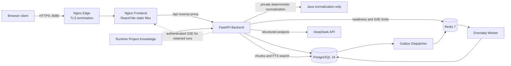

# Personal Job Agent

Personal Job Agent is a private, evidence-grounded workspace for comparing a Resume with a Job Description (JD), producing reviewable analysis, and tracking applications.

**Current production:** `v2.2.0` · **Alembic:** `20260820_08`

AI output is advisory and requires human review. The product does not submit job applications,
contact employers, or guarantee ATS, interview, or hiring results.

## What It Does

- **Resume management and Primary Resume** — upload, version, archive, and keep one active Resume selected for analysis.
- **Resume–JD analysis** — combine DeepSeek-assisted narrative with evidence mapping, deterministic scoring, warnings, and a safe local fallback.
- **Project Knowledge RAG** — retrieve relevant evidence from the reviewed project corpus and expose the sources used by an analysis.
- **History and Applications tracking** — save analyses, record manual or analysis-linked submissions, and preserve the Resume snapshot used at apply time. Applications can be deleted after confirmation without deleting their source Analysis, History, or Resume.
- **AI and security controls** — authenticated Sessions, ownership checks, CSRF/Origin protection, input/output scanning, prompt boundaries, and claim grounding.
- **Monitoring and operations** — readiness, metadata-only monitoring and Evaluation, retained Agent Run operations, worker/outbox health, and backup and rollback procedures.

## Architecture

Personal Job Agent is a modular monolith: FastAPI owns the public API and workflow, with React,
PostgreSQL, Redis/Dramatiq, a Transactional Outbox, and a private normalization service supporting it.


```mermaid
flowchart LR
    Client[Browser client] -->|HTTPS :8080| Edge[Nginx Edge<br/>TLS termination]
    Edge --> Web[Nginx Frontend<br/>React/Vite static files]
    Web -->|/api reverse proxy| API[FastAPI Backend]
    API -->|private deterministic normalization| Java[Java normalization-only]
    API --> DB[(PostgreSQL 16)]
    API -->|readiness and SSE limits| Redis[(Redis 7)]
    API -->|structured analysis| DeepSeek[DeepSeek API]
    Runtime[Runtime Project Knowledge] --> API
    API -->|chunks and FTS search| DB
    DB --> Outbox[Outbox Dispatcher]
    Outbox --> Redis
    Redis --> Worker[Dramatiq Worker]
    Worker --> DB
    API -. authenticated SSE for retained runs .-> Web
```

The normal workflow is synchronous: `Resume + JD → normalization/security → RAG → DeepSeek →
deterministic validation/scoring → History/Application`.
Production uses a private stateless Java service for deterministic JD normalization, with a safe
local fallback; Java owns no application data and has no public port. Redis, the Worker, and
Outbox remain supporting infrastructure for retained Agent Run state and operations.

## Tech Stack

| Layer | Main technologies |
| --- | --- |
| Web | React 19, React Router, Vite, and project-owned responsive CSS |
| API | Python 3.12, FastAPI, Uvicorn, Pydantic, and SQLAlchemy 2 |
| Data | PostgreSQL 16, Alembic, and private file storage |
| Async foundation | Redis 7, Dramatiq, and a PostgreSQL Transactional Outbox |
| AI and retrieval | DeepSeek's OpenAI-compatible API and PostgreSQL full-text RAG |
| Delivery | Spring Boot normalization, Docker Compose, Nginx/HTTPS, and immutable GHCR images |

## Key Engineering Highlights

- **Evidence-grounded AI / RAG** — a reviewed project corpus, bounded retrieval, evidence IDs,
  and backend-created source metadata keep project claims grounded.
- **Structured validation + deterministic fallback** — DeepSeek is advisory; local validation,
  evidence reconciliation, and scoring keep results useful when model output is incomplete.
- **Analyze idempotency / durable execution** — PostgreSQL owns keyed request state and completed
  replay, avoiding duplicate Provider calls or History rows for a completed duplicate.
- **Transactional Outbox / Redis / worker architecture** — durable state is published through
  Redis/Dramatiq with leases, heartbeats, recovery, and dead-letter handling for retained work.
- **Security and production operations** — Argon2 and server Sessions, CSRF/Origin and ownership
  boundaries, prompt/secret/PII scanning, immutable artifacts, gates, backups, and rollback.

## Quick Start

Requirements: Python 3.12, Node.js 22, and npm. Local development uses an isolated SQLite
database by default; production uses PostgreSQL 16.

```bash
git clone https://github.com/HKJoker-Z/personal-job-agent.git
cd personal-job-agent
cp .env.example .env

python3 -m venv .venv
.venv/bin/pip install -r backend/requirements.txt
(cd frontend && npm ci)

# Set the required local values in .env first.
APP_ENV=development .venv/bin/alembic -c backend/alembic.ini upgrade head
PYTHONPATH=backend APP_ENV=development .venv/bin/python -m app.cli \
  users create-admin --email admin@example.com --display-name "Local Admin"
```

Run the API and frontend in separate terminals:

```bash
APP_ENV=development .venv/bin/uvicorn --app-dir backend main:app \
  --host 127.0.0.1 --port 8000 --reload
```

```bash
cd frontend
VITE_BACKEND_PROXY_TARGET=http://127.0.0.1:8000 npm run dev -- \
  --host 127.0.0.1 --port 5173
```

See [Development](docs/V2_DEVELOPMENT.md) for tests, Compose smoke, and release checks.

## Production

Production is a single-host Docker Compose deployment: `HTTPS Nginx Edge → Frontend → FastAPI`,
plus private Java normalization, PostgreSQL 16, Redis, a Dramatiq Worker, and an Outbox Dispatcher.
Only the Edge is public; application and data services stay on private networks.

The current release is [v2.2.0](https://github.com/HKJoker-Z/personal-job-agent/releases/tag/v2.2.0),
running with Alembic `20260820_08`; this release has no migration. Deployments use immutable image
digests, candidate and health gates, PostgreSQL 16 backup/restore verification, and recorded
rollback assets. Details belong in the [deployment runbook](docs/DEPLOYMENT.md) and [backup /
restore guide](docs/V2_BACKUP_AND_RESTORE.md).

## Limitations

- The product is private and administrator-led; there is no public signup or multi-tenant SaaS operating model.
- AI output may be incomplete, incorrect, or unavailable. Results need human review, and the
  product does not automatically apply, email, or contact an employer.
- Project Knowledge uses lexical PostgreSQL full-text search, not vector search. Scanned PDFs
  without selectable text require external OCR, and safe JD URL extraction cannot parse every site.
- Production is single-host Docker Compose without high availability or a zero-downtime guarantee.
- Jobs, Job Rankings, Approvals, and Tasks are retired/disabled; Applications are supported.

## Documentation

- [Architecture](docs/ARCHITECTURE.md) · [Architecture Decision Records](docs/adr/README.md)
- [Project Knowledge](docs/PROJECT_KNOWLEDGE.md) · [RAG](docs/V2_RAG.md)
- [Development](docs/V2_DEVELOPMENT.md) · [Security model](docs/V2_SECURITY.md)
- [Deployment and rollback](docs/DEPLOYMENT.md) · [PostgreSQL backup / restore](docs/V2_BACKUP_AND_RESTORE.md)
- [Analyze idempotency](docs/ANALYZE_IDEMPOTENCY.md) · [DeepSeek provider contract](docs/DEEPSEEK_PROVIDER_ACCEPTANCE.md)
- [Java normalization integration](docs/architecture/JAVA_PRODUCTION_NORMALIZATION_INTEGRATION.md) · [v2.2.0 release notes](docs/V2_2_0_RELEASE_NOTES.md) · [GitHub Releases](https://github.com/HKJoker-Z/personal-job-agent/releases)
- [Versioned API contracts](docs/V2_0_4_API.md) · [Applications API and workflow](docs/V2_1_0_RELEASE_NOTES.md) · [Work reports](docs/work-reports/README.md)
