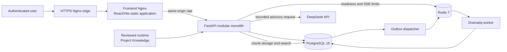
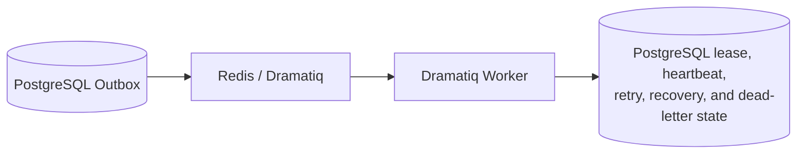

# Personal Job Agent Architecture

This document describes the architecture implemented by the Version 2.0.3
release. Personal Job Agent is a **modular monolith**, not a collection of
event-driven microservices. The FastAPI application contains the product
modules and request orchestration in one deployable backend. PostgreSQL, Redis,
asynchronous worker processes, the React frontend, Nginx, and operational
processes support that application.

## System context

The frontend is a compiled static client. It does not contain provider
credentials and reaches application data only through the authenticated
same-origin API. The backend enforces sessions, Origin/CSRF checks, ownership,
input validation, and safe error boundaries. PostgreSQL is authoritative for
application state and durable Agent Run/Outbox state.

## A. Current synchronous Resume-to-JD analysis

The current Resume-to-JD workflow is a synchronous backend request. It does not
create a new public Agent Run and does not use Redis or Dramatiq to perform the
analysis.

```mermaid
flowchart LR
    Browser[Browser]
    API[FastAPI<br/>POST /api/analyze]
    Deterministic[Validation, normalization,<br/>truncation, and scanning]
    Retrieval[Optional Project Knowledge<br/>retrieval]
    Advisory[DeepSeek advisory<br/>analysis]
    Recovery[Tolerant parsing,<br/>one repair, or fallback]
    Reconcile[Evidence<br/>reconciliation]
    Score[Deterministic<br/>scoring]
    Persist[Optional History<br/>persistence]

    Browser --> API
    API --> Deterministic
    Deterministic --> Retrieval
    Retrieval --> Advisory
    Advisory --> Recovery
    Recovery --> Reconcile
    Reconcile --> Score
    Score --> Persist
```

### Deterministic application logic

FastAPI validates that each request has exactly one Resume source and one JD
source. It extracts or loads Resume text, safely acquires an allowed HTTPS job
URL when requested, normalizes and section-truncates oversized inputs, scans
untrusted content, constructs the bounded prompt, and controls the workflow
audit trail. These steps do not delegate authorization or product decisions to
the model.

### DeepSeek-assisted advisory analysis

The backend makes a bounded call to `deepseek-chat` through DeepSeek's
OpenAI-compatible API. The model proposes compact skill judgments,
assessments, evidence references, and recommendations. The backend accepts
standard JSON, performs bounded structural normalization, and may make at most
one format-only repair call. If the provider or response remains unusable, a
deterministic local keyword fallback returns the stable result shape.

DeepSeek does not own the final score, trusted source metadata, authorization,
persistence identity, or an employment decision.

### Project Knowledge RAG

The reviewed `docs/PROJECT_KNOWLEDGE.md` baseline is deployed as a separately
managed runtime copy and indexed into PostgreSQL chunks. When RAG is enabled,
the backend builds a bounded query, retrieves top-k chunks with PostgreSQL
full-text search, scans them, and places only those chunks in the project
evidence section of the prompt. SQLite FTS5 and bounded keyword retrieval are
development/test fallbacks. No vector database or general-purpose personal
document corpus is used.

### Evidence reconciliation

Model evidence IDs are checked against the Resume and Project Knowledge chunks
available to the current request. Unsupported or unknown references are
rejected. The backend reconciles matched and missing skills, removes
unsupported candidate claims, creates safe `rag_sources`, and reports warnings
when usable content is downgraded. Project evidence can support a transferable
project skill; it is not converted into fictional employment experience.

### Deterministic scoring

After reconciliation, backend code recalculates the scoring dimensions and
weighted match score. The configured dimensions are skills match, project
experience, education, work experience, and keyword match. This deterministic
step runs for model-assisted and fallback results, so the model cannot directly
set the final score.

### Human review

The UI presents the analysis state (`complete`, `repaired`, `partial`, or
`fallback`), warnings, score breakdown, evidence mapping, RAG sources, and
recommendations for review. The user decides whether to save or act on the
information. The application does not submit an application, contact an
employer, guarantee an ATS result, or make an autonomous hiring decision.

### Persistence and monitoring

PostgreSQL stores users and Sessions, Career Profiles, Resumes and immutable
Versions, private File Asset metadata, optional History results, Project
Knowledge documents/chunks, monitoring and Evaluation records, and retained
Agent Run/Outbox state. History save is optional; monitoring captures bounded
workflow metadata rather than full Resume or JD text. Administrators can use
the implemented monitoring and deterministic offline Evaluation views.

### Production operations

Production Nginx terminates HTTPS and serves the frontend, whose Nginx process
proxies `/api` to FastAPI on private networks. PostgreSQL and Redis are not
host-published. Readiness covers the expected Alembic revision, storage,
Project Knowledge, database search, Redis, worker heartbeat, disk space,
authentication initialization, and provider configuration without calling
DeepSeek.

The production topology also includes a Dramatiq worker and standalone
Transactional Outbox dispatcher. They are supporting processes of the modular
monolith, not independently owned product microservices. Immutable images,
least-privilege containers, candidate staging, health checks, PostgreSQL 16
backup/restore verification, and recorded rollback assets form the operational
release boundary.

## B. Retained asynchronous Agent Run infrastructure

This is a separate retained execution foundation. It is not part of the normal
`POST /api/analyze` request path.

Redis is the Dramatiq broker and coordinates per-user SSE connection counts in
production. It is not the authoritative store for Agent Run state. Queue
messages contain identifiers and workflow metadata only; Resume/JD/business
text and credentials are rejected from the payload.

The PostgreSQL Transactional Outbox records work in the same durable state
boundary as an Agent Run. The dispatcher publishes due entries to Redis,
recovers interrupted publications and queue deliveries, and records exhausted
publication attempts as dead letters. Dramatiq workers claim steps with
database locks, attempts, and leases; write heartbeats; recover expired work;
and let application-owned retry rules decide whether a step is rescheduled.

In Version 2.0.3, this machinery remains a production health dependency and
supports retained Agent Run state, but the Application-based public workflow
that created new runs is retired. Users may inspect retained Runs, read their
Steps/Events and authenticated SSE stream, and cancel them. Public create,
retry, and resume requests are disabled.

### Current product status

- New Agent Run create, retry, and resume operations are disabled.
- Historical Agent Runs remain readable, streamable, and cancellable.
- Redis, the Worker, and the Outbox dispatcher remain operational
  infrastructure retained for compatibility and operational workflows.
- Jobs, Job Rankings, Applications, Approvals, and Tasks are not current
  user-facing product features.

## Architectural records

The [ADR index](adr/README.md) records the existing decisions behind the
modular monolith, advisory analysis boundary, and Redis/worker foundation.
Version-specific detail remains in
[Version 2.0.3 Architecture](V2_0_3_ARCHITECTURE.md).
