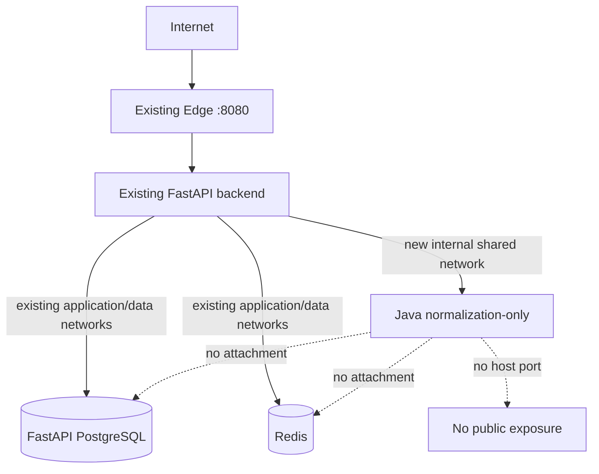

# Java Production Normalization Integration

## 1. Executive decision

**GO with a normalization-only production integration, implemented and rolled
out in bounded later phases. Do not deploy or integrate it as part of this
audit.**

The smallest safe design is one private, stateless Spring Boot normalization
service used only by synchronous `POST /api/analyze`. FastAPI remains the
public application and keeps every user, security, retrieval, model,
idempotency, History, and monitoring responsibility. Java supplies only
deterministic text normalization, bounded metadata normalization, lexical skill
extraction, a content hash, and version identifiers.

The merged Java `normalization-only` profile is stateless at startup and has
test/container evidence that PostgreSQL, JDBC, JPA, Flyway, persistence
routes, and database health are inactive. The unchanged default/full Java
profile still requires its standalone PostgreSQL/Flyway/JPA stack. Merged
Phase II added the FastAPI `local`/observation-only `shadow` client boundary.
Phase IIIA now implements the reviewed Java-authoritative execution contract,
safe local fallback, and legacy-compatible persistence. Phase IIIB now supplies
an isolated disposable candidate and synthetic end-to-end evidence. Every
production topology, rollout, migration, and deployment action remains future
Phase IV work.

Do not integrate Java-owned create, read, update, or version-history APIs.
There is no current Personal Job Agent product requirement for a second owner
of Job Description data, and doing so would risk reactivating retired Jobs
behavior.

## 2. Current architecture

Personal Job Agent 2.0.4 is a FastAPI modular monolith with a React client,
PostgreSQL 16, Redis/Dramatiq foundations, and a synchronous Analyze workflow.
The Java service is an independently containerized portfolio service with its
own PostgreSQL/Flyway design and a stateless normalization-only profile.
FastAPI can call that private contract in reviewed source code, but no
production topology has been created and Java is not deployed or called by the
production Personal Job Agent. The Phase IIIB candidate topology exists only
under `ops/candidate/java-normalization/`; it uses a unique Compose project,
synthetic PostgreSQL data, and the test-only mock provider, then removes its
own resources.

The public Analyze security middleware runs outside the route:

- application composition:
  `backend/app/application.py:26-43`;
- request-body precheck:
  `backend/app/auth/middleware.py:59-80`;
- Session authentication:
  `backend/app/auth/middleware.py:84-104`;
- Origin and CSRF enforcement:
  `backend/app/auth/middleware.py:105-124`; and
- trusted Request ID creation and response propagation:
  `backend/logging_utils.py:19-26` and
  `backend/logging_utils.py:91-124`.

The React Analyze screen loads the owned Primary Resume and selects its active
version at `frontend/src/legacy-workspace.jsx:952-978`. The API itself accepts
exactly one upload or `resume_version_id`; it does not silently resolve
“Primary” at the Analyze route. Owned Resume Version resolution is in
`backend/legacy_application.py:2630-2686` and
`backend/app/resumes/service.py:155-177`. Uploaded PDF/DOCX parsing is in
`backend/legacy_application.py:437-485`.

### Current Analyze JD path

1. FastAPI accepts exactly one pasted `job_text` or `job_url`
   (`backend/legacy_application.py:2596-2608`).
2. A URL is acquired only through `SafeJobUrlFetcher`
   (`backend/legacy_application.py:488-496` and
   `backend/app/jobs/acquisition.py:76-165`). It validates every redirect,
   resolves and pins a globally routable address, rejects local/private/
   reserved/obfuscated targets, bounds compressed and expanded bodies, and
   restricts media types.
3. Pasted text is stripped. Fetched text is extracted and normalized by the
   acquisition layer. Both then pass through `structure_aware_truncate`
   (`backend/legacy_application.py:2718-2746` and
   `backend/analysis_fallback.py:40-111`).
4. The default effective bound is 60,000 characters and is configurable only
   within 1,000–120,000
   (`backend/config.py:145-151`). The whole request has a default 12 MiB
   Content-Length precheck (`backend/app/core/config.py:203-205`).
5. The current idempotency fingerprint is computed from the acquired,
   locally-normalized/truncated `context.job_text` before security scanning
   (`backend/legacy_application.py:2757-2804`). Its canonical fields are
   defined at `backend/app/analyze/idempotency.py:116-152`.
6. Resume and JD security scanning creates `context.sanitized_job_text`
   (`backend/legacy_application.py:2806-2843`).
7. The sanitized JD drives the Project Knowledge query
   (`backend/legacy_application.py:2860-2867` and
   `backend/legacy_application.py:1526-1535`), safe prompt
   (`backend/legacy_application.py:2951-2957`), primary DeepSeek call
   (`backend/legacy_application.py:2972-2985`), deterministic fallback
   (`backend/legacy_application.py:3092-3113`), and deterministic scoring
   (`backend/legacy_application.py:3162-3173`).
8. A single explicit format-only repair may occur
   (`backend/legacy_application.py:3058-3106` and
   `backend/legacy_application.py:1294-1340`).
9. History persists derived analysis fields and, for URL input, the URL. It
   does **not** persist the raw or sanitized JD text
   (`backend/app/analyze/idempotency.py:396-507` and
   `backend/database.py:858-951`).
10. The frontend receives and renders the derived result. It does not receive
    the full JD text (`frontend/src/legacy-workspace.jsx:849-930`).
11. Best-effort monitoring persists bounded outcome, workflow, RAG, security,
    and timing fields, never the JD
    (`backend/legacy_application.py:1857-1902` and
    `backend/monitoring_service.py:174-233`).

“Raw JD” therefore has several distinct meanings:

| Stage | Exact effective value |
|---|---|
| Browser form | User text after React `.trim()`, or the submitted URL |
| Acquired JD | Pasted text after `.strip()`, or safely extracted URL text |
| Current local JD | `structure_aware_truncate` output after NUL/HTML removal, line normalization, whitespace cleanup, and optional section-aware shortening |
| Security input | Current local JD |
| RAG/prompt/fallback/scoring | Security-sanitized local JD |
| Existing fingerprint | Hash of current local JD, not the security-sanitized JD |
| History | No full JD; derived result fields and optional URL only |
| Frontend response | No full JD; derived result fields only |

## 3. Proposed architecture

```mermaid
flowchart LR
    B[Authorized browser] -->|Session, Origin, CSRF| F[FastAPI Analyze]
    F -->|safe URL acquisition when needed| A[Bounded acquired JD]
    A --> S1[FastAPI local security scan]
    S1 -->|sanitized bounded text, private Bearer key, X-Request-ID| J[Java normalization-only service]
    J -->|normalized text, hash, versions, lexical skills| V[FastAPI contract validation]
    V --> S2[FastAPI normalized-text security scan]
    S2 --> R[Project Knowledge RAG]
    R --> P[Safe prompt / local fallback]
    P --> D[DeepSeek primary and optional repair]
    D --> H[FastAPI History, idempotency, monitoring]
```

This is not a broad microservice migration. It is one private internal
normalization service used by one workflow.

### Responsibility boundary

Java owns only:

- deterministic JD text normalization;
- deterministic explicitly supplied metadata normalization;
- deterministic lexical skill extraction;
- SHA-256 content hash;
- normalization-policy version; and
- skill-dictionary version.

FastAPI continues to own:

- browser authentication, Session, CSRF, and Origin checks;
- Resume ownership and Primary Resume user experience;
- uploaded/temporary Resume processing;
- Job URL acquisition and SSRF protection;
- input bounds and security scanning;
- Project Knowledge retrieval and evidence scanning;
- prompt construction;
- Analyze idempotency and provider-attempt control;
- DeepSeek primary/repair calls and deterministic fallback;
- user ownership, History, monitoring, error mapping, and public API response.

Java must not own users, browser Sessions, FastAPI History, Resume ownership,
DeepSeek, Project Knowledge, job applications, rankings, tasks, approvals, or
autonomous actions.

## 4. Chosen deployment option

Choose **Option B: a future `normalization-only` Spring profile**.

The default Java profile currently declares datasource, Flyway, and JPA
configuration (`services/jd-normalization-service/src/main/resources/application.yml:9-30`).
Readiness includes database and schema health
(`application.yml:64-89`), and the current Compose application waits for a
database migration (`services/jd-normalization-service/compose.yml:76-115`).
Disabling persistence controllers alone is insufficient because database
auto-configuration would still start.

The profile should:

- set `jd-normalization.persistence.enabled=false`;
- set `jd-normalization.schema-health.enabled=false`;
- disable Flyway;
- exclude datasource, JDBC, JPA/Hibernate, transaction-manager, and Flyway
  auto-configuration;
- disable database health;
- expose only status-only liveness/readiness and normalize; and
- retain internal API-key authentication, Request ID handling, limits,
  deterministic dictionary loading, read-only/non-root execution, and safe
  logging.

Keeping persistence libraries in the same JAR is acceptable initially if
startup tests prove those systems are inactive. Splitting artifacts or Maven
modules is not justified until measured image/startup pressure or maintenance
cost requires it.

## 5. Rejected options

| Criterion | A: current full service + dedicated PostgreSQL | B: normalization-only profile | C: complete Java persistence integration | D: portfolio-only |
|---|---|---|---|---|
| Business relevance | Normalize is relevant; database is unused overhead | Directly matches the Analyze need | No current product requirement | Retains current behavior but misses a bounded integration opportunity |
| Architecture honesty | Honest only if described as unused persistence capacity | Honest private deterministic service | Misrepresents two owners as a requirement | Honest, but Java remains disconnected |
| Production complexity | App, PostgreSQL, Flyway, volume, backup, restore | One stateless private container | A plus data contracts, reconciliation, ownership, and UI/product work | None |
| CPU/memory | Current local caps: 1 CPU/768 MiB app + 512 MiB DB; 384 MiB migration transient | Proposed candidate cap: 0.5 CPU/384 MiB, subject to measurement | Highest and grows with API usage | Zero |
| Disk | Application and migration images plus PostgreSQL and backups | One application image; no data growth | Images, database, versions, backup growth | Zero production disk |
| Database/backup | Dedicated Java database and tested restore required | None | New authoritative database and retention policy | None |
| Security | More credentials and attack surface; persistent endpoints remain reachable internally | Smallest API and secret surface | Largest surface and data-disclosure consequences | No new surface |
| Failure isolation | DB/migration/readiness can break normalize | Java failure isolated by FastAPI local fallback | Cross-service data failures affect product behavior | Existing isolation |
| Rollback | Stop app/DB after mode local; retain volume | Mode local, then stop one container | Requires data-owner and behavior rollback | No rollback needed |
| Development scope | Deployment/backup work despite unused persistence | Focused profile, client, fingerprint, tests | Large product and migration program | None |
| Testing scope | DB migrations, backup/restore, normalize, integration | Profile, client, workflow, candidate | All CRUD/version/ownership/reconciliation cases | Existing tests only |
| Résumé value | Operations breadth, but hard to justify | Stronger boundary/fallback/rollout story | Looks broad but is architecturally weak | Java portfolio service only |
| Interview value | Invites “why a database you do not use?” | Clear trade-off and failure-isolation discussion | Invites distributed ownership criticism | Limited production integration discussion |
| Retired Jobs risk | Persistent APIs exist but are not used | Persistence endpoints absent | High; effectively revives Jobs behavior | None |
| Distributed ownership risk | Low if DB truly unused, but still operationally present | None for JD persistence | High and unnecessary | None |

Option A is a fallback only if a time-boxed Phase I spike proves that excluding
database auto-configuration requires disproportionate restructuring. Current
conditional components indicate that outcome is unlikely.

Option C is explicitly rejected. Repository evidence shows no current product
requirement for Java-owned JD persistence. FastAPI History already stores the
derived Analyze result, and the public Jobs workflow is retired.

Option D remains the rollback/no-deployment alternative if the candidate
cannot stay within a reviewed resource and latency budget.

## 6. Analyze sequence

The Phase IIIA runtime uses this exact order:

1. Request logging establishes the authoritative trusted `X-Request-ID`.
2. V2 middleware enforces body size, Session authentication, Origin, and CSRF.
3. FastAPI validates exactly one Resume source and exactly one JD source.
4. FastAPI resolves the owned Resume Version or parses the bounded upload.
5. FastAPI safely acquires pasted text or URL content. URL SSRF, redirect, DNS,
   address, media-type, and byte protections complete before Java is eligible.
6. Existing local JD preprocessing and the FastAPI configured text bound run.
   This output remains the `local` candidate and immediate fallback.
7. Compute the stable input fingerprint and perform a completed-response
   preflight replay check. A valid completed response may replay without
   calling Java.
8. Run the current FastAPI security scan on the local candidate. A blocked
   input is never sent to Java or a provider.
9. In `shadow` when sampled, or in `java`, make one bounded Java attempt using
   the first scan's sanitized JD and the trusted Request ID.
10. Validate response byte size, JSON schema, content hash, expected policy and
    dictionary versions, skill bounds, metadata bounds, and exact Request ID.
11. In `java`, scan Java normalized text again and merge raw/local and
    normalized findings. In `shadow`, the second scan is observation-only and
    cannot change the user-visible result.
12. Select effective JD and normalization source:
    `local`, `java`, or `fallback_local`.
13. Compute `analyze-execution-v1` from the unchanged stable fingerprint and
    selected effective normalization. Atomically bind it to the current
    processing attempt token before any RAG, prompt, or provider work.
14. Retrieve and security-scan Project Knowledge with the selected effective
    JD.
15. Build the safe prompt from the same effective JD.
16. Execute the existing primary DeepSeek attempt, at most one explicit
    format-only repair, or the existing deterministic fallback.
17. Reconcile evidence, score, finalize History/idempotency atomically, persist
    existing monitoring best-effort, and return the unchanged public result
    contract.

Java normalization must never precede safe URL acquisition.

## 7. Security-scan placement

Scan **both** the existing local effective JD and a successful Java normalized
JD in `java` mode.

The first scan preserves every current prompt-injection, credential-like data,
PII, and redaction control before another service receives the bounded text.
Java receives only the first scan's sanitized output. The second scan prevents
normalization from weakening or accidentally transforming security signals
before RAG or prompt construction. Findings are merged conservatively.

In `shadow`, current FastAPI behavior remains authoritative. Java output and
its observation-only scan cannot block, sanitize, change RAG, alter the prompt,
change History, change the execution fingerprint, or change the response. In
`java`, a blocked or unusable second-scan result cannot enter RAG or the prompt;
FastAPI selects `fallback_local` and binds the explicit local contract instead.

## 8. Feature-flag modes

Exactly three case-sensitive normalized values are supported:

| Mode | Behavior |
|---|---|
| `local` | Exact 2.0.4 local preprocessing remains authoritative; Java is not required or called; immediate rollback |
| `shadow` | Local remains authoritative; a deterministic bounded sample makes one synchronous Java attempt after the current security scan; failure never fails Analyze |
| `java` | Valid Java normalized text is authoritative; any Java failure/timeout/invalid response/version mismatch falls back to the existing local path |

Proposed configuration follows the existing `ANALYSIS_*` naming for Analyze
behavior and the Java service's `JD_NORMALIZATION_*` boundary:

- `ANALYSIS_JD_NORMALIZATION_MODE`;
- `JD_NORMALIZATION_BASE_URL`;
- `JD_NORMALIZATION_API_KEY_FILE` (preferred) or a secret-injection mechanism
  that does not store a literal in Compose;
- `JD_NORMALIZATION_CONNECT_TIMEOUT_MS`;
- `JD_NORMALIZATION_RESPONSE_TIMEOUT_MS`;
- `JD_NORMALIZATION_TOTAL_TIMEOUT_MS`;
- `JD_NORMALIZATION_MAX_RESPONSE_BYTES`;
- `JD_NORMALIZATION_EXPECTED_POLICY_VERSION`;
- `JD_NORMALIZATION_EXPECTED_DICTIONARY_VERSION`; and
- `JD_NORMALIZATION_SHADOW_SAMPLE_RATE`.

`local` must start without Java configuration. `shadow` and `java` must fail
startup safely if URL, key source, timeout bounds, response bound, or expected
versions are missing/invalid. Any unknown mode fails startup. The base URL is
an operator-controlled private origin, not request input.

Shadow sampling should be deterministic from a domain-separated hash of the
stable input fingerprint, not a user identifier or raw text. The rate is a
bounded decimal from 0 through 1 and is explicitly reviewed at rollout. Calls
are synchronous only for sampled requests, with the same short total deadline
as `java`; this avoids unmanaged background tasks and bounds latency.

## 9. Internal client

Use an application-scoped `httpx.AsyncClient`. `httpx` is already present
through the pinned OpenAI stack and is used by repository tests, but it should
become an explicit direct requirement rather than an accidental transitive
dependency. It suits an async FastAPI route better than introducing another
client. The specialized `urllib3` client remains correct for untrusted Job URL
acquisition because it implements DNS/IP pinning; the Java client has a fixed,
trusted private base URL and a different threat model.

Initial safety budgets for candidate validation:

- connect timeout: 200 ms;
- response read/write timeout: 600 ms;
- total application deadline: 800 ms;
- one application-level attempt;
- no transport or application retry;
- no redirects;
- maximum response: 256 KiB; and
- a small shared pool, initially 10 total and 5 keep-alive connections.

These are failure-containment budgets, not performance claims. Candidate
measurements must confirm or revise them before production. Use
`trust_env=False` so the private call never enters Mihomo or inherited HTTP
proxy settings. Close the application-scoped client during FastAPI shutdown.

The client sends:

- `POST /api/v1/job-descriptions/normalize`;
- `Content-Type: application/json`;
- `Authorization: Bearer <internal key>`;
- the trusted `X-Request-ID`; and
- initially only `raw_text`, unless FastAPI later has explicitly trusted,
  bounded metadata worth normalizing.

Do not automatically forward the browser's URL, title, company, or location.
FastAPI URL acquisition remains authoritative, and the current Analyze path
does not retain the acquired page metadata. Java skill arrays are validated
and may support comparison evidence, but they do not replace current matching
or scoring in the first integration.

The client must not log Authorization, API key, raw JD, normalized JD, title,
company, location, canonical URL, request body, or complete Java response.

## 10. Request ID propagation

FastAPI's trusted Request ID grammar is
`[A-Za-z0-9][A-Za-z0-9._:-]{0,63}`
(`backend/logging_utils.py:19-26`). Java implements the same grammar and
returns the accepted ID (`RequestIdFilter.java:39-44` and
`RequestIdFilter.java:162-173`).

FastAPI must send its authoritative `X-Request-ID` and require the exact same
value in the Java response header. For an error envelope, the body
`error.request_id` must also match.

| Java result | FastAPI behavior |
|---|---|
| Missing response header | Invalid response; fallback; `request_id_missing` observation |
| Different header | Invalid response; fallback; `request_id_mismatch` observation |
| Invalid header grammar | Invalid response; fallback; `request_id_invalid` observation |
| Error body ID differs from header | Invalid response; fallback |

The public FastAPI Request ID never changes. It is observational metadata only,
not authentication, authorization, idempotency, or ownership.

## 11. Timeout and fallback

Use one Java attempt and no automatic retry. Determinism and retry safety do
not justify consuming more synchronous Analyze latency. DNS, connection,
write, response, JSON, schema, version, hash, and Request ID failures all
produce a safe internal outcome and use the current local effective JD.

The public user sees the normal Analyze response or an existing FastAPI error;
Java error messages and bodies are never exposed. A fallback is not itself an
Analyze failure.

## 12. Analyze fingerprint impact

One fingerprint cannot simultaneously provide immutable completed replay and
distinguish a later execution under a different normalization source. Phase
IIIA therefore maintains:

1. **stable input fingerprint** — retain the current
   `analyze-request-fingerprint:v1` semantics for backward compatibility:
   acquired local JD hash, Resume/version, URL, RAG/top-k, Project Knowledge
   version, History choice, model, analysis contract, and security policy; and
2. **execution fingerprint** — the domain-separated, canonical, binary
   `analyze-execution-v1` SHA-256 containing the stable fingerprint, exact
   effective JD text hash, source (`local`, `java`, or `fallback_local`),
   effective normalization policy, and an explicit Java dictionary version or
   null. Request ID, Idempotency-Key, attempt token, time, database identity,
   duration, and transient errors are excluded.

The existing Analyze ledger has nullable execution fingerprint, contract,
source, policy, dictionary, and bound-time columns. Database checks require a
32-byte fingerprint, supported source, nonblank values, and consistent
all-null/all-present metadata. There is no default, backfill, new table, or
execution lookup index. Local and `fallback_local` execution use the explicit
`fastapi-local-jd-v1` identity and a null dictionary; this does not claim that
local preprocessing implements the Java policy.

Completed-row behavior:

- if user, key, operation, and stable input fingerprint match a completed row,
  replay its stored response exactly regardless of the current mode or Java
  version;
- do not call Java, mutate the row, rewrite History, or recompute the result;
- if stable input differs, return existing `IDEMPOTENCY_KEY_REUSED`.

Non-completed behavior:

- a source/version/content change produces a different execution fingerprint
  and the same key returns `IDEMPOTENCY_EXECUTION_CONFLICT`;
- the binding operation requires processing state and the current attempt
  token, and atomically accepts only all-null or exactly identical metadata;
- identical rebinding is idempotent; stale attempts cannot bind or overwrite;
- provider-start and finalization both require the expected binding; and
- legacy failed and indeterminate rows retain the existing state-machine
  behavior. Unknown historical execution metadata is never backfilled.

Transitions:

| Transition | Safe behavior |
|---|---|
| `local` → `shadow` | Authoritative source remains `local`; execution fingerprint unchanged; shadow evidence excluded |
| `shadow` → `java` | New keys use Java execution fingerprint; matching completed keys replay old results |
| Policy update | New keys record new version; matching completed keys replay; unfinished same-key mismatch is rejected |
| Dictionary update | Same as policy update |
| Java failure | Select before binding; new attempt records `fallback_local` and the local effective hash/identity |
| Rollback to `local` | Completed Java/`fallback_local` results replay from ledger; new keys use local |

This prevents a local attempt and a Java attempt with the same non-completed
key from being incorrectly considered equivalent without invalidating
completed ledger rows.

## 13. Shadow comparison

Shadow stores no JD or full metadata. Compute hashes in memory only and discard
the values after equality comparison. One safe structured observation may
contain:

- mode `shadow`;
- Java attempt outcome;
- Java duration;
- normalized-text hash equality boolean;
- policy version;
- dictionary version;
- required/preferred/mentioned skill ID difference counts;
- response-validation outcome; and
- bounded fallback/rejection reason code.

Do not persist actual text hashes in the initial design. Even hashes can become
correlation identifiers for repeated sensitive text. Do not store raw text,
normalized text, metadata, Authorization, keys, or the complete response.

Use bounded structured logs initially, not a new table. Existing Analyze and
workflow metrics already provide overall failure and duration evidence. If a
long-lived product requirement later needs historical normalization analytics,
review additive low-cardinality columns on `analysis_metrics`; do not create a
new high-cardinality metric system by default.

## 14. Metrics

Emit low-cardinality observation fields/counters:

- normalization mode and authoritative source;
- Java attempted/success/timeout/unavailable/invalid-response counts;
- local fallback count;
- Java duration;
- shadow equality count;
- policy mismatch count;
- dictionary mismatch count; and
- Request ID propagation failure count.

Do not use Request ID, content hash, JD, URL, title, company, location, or skill
IDs as metric labels.

Deployment acceptance evidence must report observed call count, success and
fallback rates, median and p95 Java latency, shadow comparison rate, Analyze
failure correlation, and Request ID propagation failures. Set progression
thresholds only after candidate and shadow measurements. Do not claim a
performance improvement without comparative measurements.

## 15. Production topology

Use a separate, small Java Compose project attached to one explicitly named,
internal shared network also attached to the FastAPI backend:

Requirements:

- Java has no host port and is not attached to `pja-br0`;
- a dedicated internal bridge contains only FastAPI and Java;
- Java has no FastAPI PostgreSQL, Redis, or host volume;
- FastAPI keeps its existing egress path for safe URL acquisition and
  DeepSeek;
- Java uses `trust_env=False` from the client side and needs no external
  egress;
- explicit health check, non-root user, read-only root filesystem, dropped
  capabilities, no-new-privileges, bounded `/tmp`, PIDs, CPU, and memory; and
- independent Java start/stop and rollback.

### Compose strategy comparison

| Strategy | Assessment |
|---|---|
| Add full Java stack to root production Compose | Rejected: couples DB/migration/backup and main cutover |
| Separate Java project + explicit shared private network | **Selected:** clearest rollback, volume, image, and health boundary |
| Root Compose override/profile | Useful for candidate work, but production ownership can become implicit and command-order dependent |
| Stateless service in same project | Technically simple, but couples Java lifecycle to every Personal Job Agent cutover |

The shared network must have explicit ownership and a stable name. One
reviewed deployment unit creates it as internal; the other references it as
external. Never allow a generic `compose down` to remove a network still needed
by FastAPI. The Java project has no shared volume.

## 16. Resource budget

Read-only production evidence on 2026-07-29:

- 4 online CPUs;
- 3.6 GiB RAM total, 2.3 GiB available, 221 MiB free;
- 1.9 GiB swap total, 115 MiB used;
- load averages 0.40, 0.54, and 0.44;
- 40 GiB root filesystem, 27 GiB used, 12 GiB available (70%);
- eight running containers, all healthy with zero restart count;
- three bounded samples showed about 442–450 MiB aggregate running-container
  memory;
- normal CPU was low with short bursts;
- Docker reported 7.881 GB of images and 5.188 GB of build cache; and
- the existing Java application and migration images are approximately
  527 MB and 710 MB locally, respectively. They were validation images, not
  published production artifacts.

The host has enough observed RAM/CPU headroom for **one bounded stateless
candidate**, but disk and swap evidence argue against adding an unnecessary
database/migration/backup stack.

Provisional candidate limits:

- `cpus: "0.50"`;
- `mem_limit: 384m`;
- `pids_limit: 128`;
- JVM `-Xms64m -Xmx256m` plus a bounded metaspace/native budget;
- 64 MiB noexec/nosuid/nodev `/tmp`; and
- status-only readiness/liveness.

These are candidate ceilings, not measured production sizing. Stop if the JVM
approaches the memory ceiling, swaps materially because of the service,
restarts, affects host load, or cannot meet the reviewed timeout. Adjust only
from candidate evidence.

If Option A were ever forced, it would additionally require a dedicated Java
PostgreSQL, named volume, Flyway job, separate migration/runtime credentials,
database limits, backup retention, and restore validation. Never reuse FastAPI
PostgreSQL/Alembic, production Redis, credentials, public ports, or `pja-br0`.

## 17. Secret handling

Generate at least 32 random bytes with a cryptographically secure mechanism in
a process that does not write the value to command history or logs. Store it
outside Git in a root-controlled production secret file, mode 0600, and mount
it read-only through Compose secrets/config-tree support. Both applications
should read a file path; do not expose the value in Compose YAML literals,
Docker image layers, Work Reports, `docker inspect` environment output, or
logs.

Rotation procedure:

1. set normalization mode to `local`;
2. retain the old key until validation completes;
3. generate and install a new secret file securely;
4. restart/recreate only Java with the new key;
5. restart/recreate FastAPI with the matching client secret;
6. validate private authenticated connectivity with synthetic data;
7. resume `shadow`, then `java` only after evidence; and
8. revoke/remove the old key after rollback validation.

For suspected compromise, immediately select `local`, rotate the key, restart
the two bounded consumers, inspect only safe aggregate observations, and keep
Analyze available. Java has no user identity or impersonation mechanism.

## 18. Failure matrix

In `shadow`, every row records source `local`; Java outcomes never alter the
user result or execution fingerprint. In `java`, every Java boundary failure
below records source `fallback_local` and uses the existing local sanitized
JD. Source is selected before the single binding; fallback never overwrites a
different bound Java execution.

| Failure | FastAPI action | User result | Safe observation | Idempotency |
|---|---|---|---|---|
| DNS failure | Fallback | Normal Analyze path | `dns_failure` | Execution source `fallback_local` |
| Connection refused | Fallback | Normal Analyze path | `connection_refused` | `fallback_local` |
| Connect timeout | Fallback | Normal Analyze path | `connect_timeout` | `fallback_local` |
| Response timeout | Fallback | Normal Analyze path | `response_timeout` | `fallback_local` |
| HTTP 400 | Fallback; contract/config alert | No Java error exposed | `http_400` | `fallback_local` |
| HTTP 401 | Fallback; high-priority key/config alert; stop rollout | Normal Analyze path | `unauthorized` | `fallback_local` |
| HTTP 413 | Fallback; bounds-contract alert | Normal Analyze path | `payload_too_large` | `fallback_local` |
| HTTP 422 | Fallback; input-contract alert | Normal Analyze path | `validation_failed` | `fallback_local` |
| HTTP 500 | Fallback | Normal Analyze path | `java_internal` | `fallback_local` |
| HTTP 503 | Fallback | Normal Analyze path | `java_unavailable` | `fallback_local` |
| Malformed JSON | Fallback | Normal Analyze path | `malformed_json` | `fallback_local` |
| Oversized response | Stop reading, close response, fallback | Normal Analyze path | `oversized_response` | `fallback_local` |
| Unsupported policy | Fallback; stop rollout | Normal Analyze path | `policy_mismatch` | `fallback_local` |
| Unsupported dictionary | Fallback; stop rollout | Normal Analyze path | `dictionary_mismatch` | `fallback_local` |
| Missing/mismatched/invalid Request ID | Fallback | Normal Analyze path | bounded Request ID outcome | `fallback_local` |
| Java restart | Connection failure/timeout fallback | Normal Analyze path | unavailable/restart-correlated count | `fallback_local` |
| Java permanently disabled | Set mode `local`; no call | Exact local behavior | mode `local` | New local execution; completed replay preserved |

Java response error details are validated only enough to classify a bounded
code; complete error bodies are not logged or returned.

## 19. Candidate validation

Use one isolated candidate Compose project with:

- synthetic Resume;
- synthetic JD;
- Mock DeepSeek in a non-production candidate, or forced deterministic
  fallback;
- no production user data;
- no real DeepSeek or external LLM; and
- the normalization-only Java profile with no PostgreSQL.

Validate local, shadow, and java modes; unknown-mode startup rejection;
authentication; Request ID round-trip and mismatch handling; successful
normalization; timeout/unavailable/malformed/oversized/version fallback;
one-attempt/no-retry behavior; raw-before-normalized scan order; RAG/prompt/
History effective-JD behavior; stable and execution fingerprints; same-key
source protection; completed replay across a mode change; safe observations;
container health/resource limits/restart; private-only connectivity; and secret
absence from image/config/logs.

One bounded candidate is sufficient. Do not create repeated redundant
environments.

## 20. Rollout

| Stage | Action | Progress evidence | Stop conditions |
|---|---|---|---|
| 0 | Merge implementation with mode `local` | Existing Analyze tests/CI unchanged; unknown modes fail startup | Any public contract, security, History, or idempotency regression |
| 1 | Deploy private stateless Java; keep FastAPI `local` | Healthy, private-only connectivity, resource limits, synthetic auth/Request ID | Public port, DB dependency, restart, resource pressure, secret exposure |
| 2 | Enable reviewed bounded `shadow` sample | Call/success/fallback counts, median/p95 duration, equality, zero user-result changes | Analyze failures correlated with shadow, Request ID failures, resource pressure |
| 3 | Review evidence and correct demonstrated incompatibilities | Document measured versions, latency, validation outcomes | Unexplained mismatches or insufficient evidence |
| 4 | Switch to `java` with local fallback | Synthetic request then normal authorized operation; source/fallback evidence | Java-caused Analyze failure, unsupported version, elevated unexplained fallback |
| 5 | Continue bounded monitoring | Success/fallback/latency/resource evidence and zero Request ID failures | Any reviewed stop condition |

Do not invent a calendar duration. Move stages only after enough observed calls
exist to review the requested evidence.

## 21. Rollback

Primary rollback:

`ANALYSIS_JD_NORMALIZATION_MODE=local`

This requires no database rollback, image rebuild, Java data transformation,
Personal Job Agent schema downgrade, or History mutation. After FastAPI is
verified in local mode, stop the Java container independently. Preserve:

- previous Personal Job Agent image digests and Compose configuration;
- Java configuration backup;
- previous internal key until rollback validation completes;
- candidate and rollout evidence; and
- any Java volume if Option A was ever used (do not delete it during immediate
  rollback).

Completed Analyze ledger responses remain exactly replayable because completed
replay checks the stable input fingerprint and ignores the current execution
mode. New keys after rollback use local execution fingerprints. Historical
results are never recomputed.

## 22. Implementation phases

### Phase I — Java normalization-only runtime

- add and test the profile;
- prove startup without PostgreSQL/JPA/Flyway;
- prove persistence endpoints are unavailable;
- retain normalize/security/Request ID/health contracts;
- add profile container smoke; and
- produce a focused Work Report.

**Implementation evidence (Phase I, PR
[#32](https://github.com/HKJoker-Z/personal-job-agent/pull/32)):**

- `application-normalization-only.yml` disables persistence, schema health,
  Flyway, and database health and excludes the applicable Spring Boot 3.5
  database/JDBC/JPA/transaction/migration auto-configurations;
- `NormalizationOnlyProfileIT` proves context startup without database
  environment variables, safe startup with impossible dummy database values,
  persistence/database bean absence, normalize/security/Request ID/error/
  health/OpenAPI behavior, and authenticated persistence-route absence;
- the focused smoke starts only the existing Java application image under
  0.50 CPU, 384 MiB, 128 PIDs, `-Xms64m -Xmx256m`, and a 64 MiB `/tmp`, with
  no database container or credentials; the bounded local observation was
  198.1 MiB / 384 MiB, healthy, zero restarts, and no OOM;
- full Maven verification retained 67 unit/MockMvc tests and 37 PostgreSQL
  integration tests with zero failures/errors/skips, while the nine new
  profile integration tests also passed; and
- the unchanged full-profile container smoke retained Flyway V1/V2,
  persistence, replay, conditional update, history, readiness, restart, and
  migration no-op validation.

Phase I was merged normally as
`e1daa69e98a583e2667fe9c70635ada1e5a87a7c`. It was not released, published,
or deployed. At that point the Java-authoritative Analyze path, execution
fingerprints, candidate validation, and every production action remained
later phases.

### Phase II — FastAPI client and safe local/shadow modes

- add validated configuration and explicit `httpx`;
- application-scoped client and cleanup;
- one attempt, timeouts, response limit, Request ID validation, safe fallback;
- local/shadow selection, reserved-and-rejected `java`, and dual security scan;
- safe structured observation; and
- unit/Analyze integration tests with no real provider.

**Implementation evidence (Phase II, PR
[#33](https://github.com/HKJoker-Z/personal-job-agent/pull/33)):**

- `local` remains the default, creates no Java client, and makes no Java
  request; `shadow` requires a validated service origin and bounded key file;
  and `java` fails startup with the Phase III execution-fingerprint
  prerequisite;
- the application-scoped `httpx.AsyncClient` is reused and closed at shutdown,
  has `trust_env=False`, follows no redirects, forwards no browser state,
  performs one attempt, and uses bounded connect/response/total timeouts,
  connection limits, and streaming response size enforcement;
- strict validation covers status/content type, exact bounded JSON structure,
  text and request bounds, recomputed SHA-256, policy/dictionary versions,
  skill uniqueness/precedence and bounds, metadata bounds, and exact trusted
  Request ID agreement;
- deterministic sampling is domain-separated from the unchanged existing
  Analyze input fingerprint; completed replay returns before shadow work;
- sampled Java input is only the first scan's sanitized JD, and the second scan
  is observation-only; Java results do not change RAG, prompt, provider,
  fallback, History, monitoring persistence, fingerprint, or public response;
  and
- safe structured observations contain only bounded request correlation,
  outcome, duration, equality, count, and expected version evidence.

Phase II was merged normally as
`ac17aa567ad664f03dbb978f7fd06c2f76e3ad05`. It was not released, published,
or deployed, and production configuration was unchanged.

### Phase IIIA — authoritative execution contract

- add nullable execution metadata to the existing ledger with legacy-null
  compatibility;
- bind `analyze-execution-v1` atomically using the current attempt token;
- enable local, shadow, Java-authoritative, and safe fallback-local selection;
- make the post-Java scan authoritative and propagate one effective JD through
  RAG, prompt, provider, scoring, deterministic fallback, and derived History;
- retain earliest completed replay and provider-indeterminate protections; and
- validate with mocked Java/provider paths and PostgreSQL 16.

Phase IIIA adds no candidate Compose, deployment scripts, Java runtime changes,
production configuration, image publication, release, or production access.

**Implementation evidence (Phase IIIA, PR
[#34](https://github.com/HKJoker-Z/personal-job-agent/pull/34)):**

- the single forward-only Alembic revision `20260730_07` extends the existing
  ledger with nullable, constrained execution-binding metadata while preserving
  legacy rows and completed replay;
- attempt-token-protected binding persists `analyze-execution-v1` before RAG
  or provider work and rejects a different bound execution with
  `IDEMPOTENCY_EXECUTION_CONFLICT`;
- `local`, `shadow`, `java`, and `fallback_local` preserve the stable request
  fingerprint and select one effective JD for RAG, prompt, provider, scoring,
  deterministic fallback, and derived History; and
- the authoritative post-Java scan, bounded monitoring evidence, provider
  ambiguity protections, and PostgreSQL 16 tests were retained without Java
  runtime changes or any production action.

Phase IIIA was merged normally as
`29c1881a924e909f13a19cb00ce25f0f7a2a4b85`. It was not released, published,
deployed, or applied to the production database.

### Phase IIIB — isolated candidate

- implemented under `ops/candidate/java-normalization/` with a unique project,
  private internal data network, candidate-only PostgreSQL volume and secrets,
  loopback-only FastAPI port, and no Java/PostgreSQL/fault-stub host ports;
- uses the real merged Java image in `normalization-only`, the merged FastAPI
  source, and the repository's test-only mock provider; it calls no real
  external LLM;
- validates fresh/no-op migration to `20260730_07`, local/shadow/java modes,
  binding before provider work, exact bounded effective-input identity,
  fallback, security ordering, replay, execution conflict, restart
  persistence, and configuration-only rollback;
- completed 20 sequential synthetic Java-mode observations with zero skipped
  cases: Java duration median/p95 10.555/16.604 ms and candidate Analyze
  median/p95 210.413/392.733 ms;
- observed Java at 189.5 MiB of 384 MiB, 0.13% CPU, and 30 of 128 PIDs in one
  point-in-time snapshot; the four running candidate services totaled about
  344.19 MiB, with zero OOM state and zero unexpected restart counts; and
- found no generated secret or synthetic JD marker in bounded logs and cleaned
  only the uniquely named candidate resources.

These are synthetic single-host candidate observations, not production
latency, capacity, reliability, or SLA evidence. The Phase IIIB recommendation
is **GO to controlled production rollout design**; Phase IV has not started and
production remains unchanged.

### Phase IV — controlled production rollout

- create the private network and separate stateless Java project;
- deploy with FastAPI still local;
- progress through shadow/java only on evidence;
- document production validation and rollback evidence separately.

Do not combine implementation and production deployment into one giant PR.

## 23. Exact file set

No implementation begins until this proposed set and phase boundaries are
reviewed.

### Phase I: Java runtime/profile

- `services/jd-normalization-service/src/main/resources/application.yml`
- `services/jd-normalization-service/src/main/resources/application-normalization-only.yml`
- `services/jd-normalization-service/Dockerfile`
- `services/jd-normalization-service/README.md`
- `services/jd-normalization-service/scripts/container-smoke.sh`
- `.github/workflows/jd-normalization-service-ci.yml`

Java tests:

- `services/jd-normalization-service/src/test/java/io/github/hkjokerz/jobagent/jdnormalization/NormalizationOnlyProfileIT.java`
- `services/jd-normalization-service/src/test/java/io/github/hkjokerz/jobagent/jdnormalization/web/SecurityWebTest.java`
- `services/jd-normalization-service/src/test/java/io/github/hkjokerz/jobagent/jdnormalization/web/NormalizationApiWebTest.java`

Documentation:

- this architecture document;
- Java README; and
- one Phase I Work Report plus `docs/work-reports/README.md`.

### Phase II: FastAPI client/configuration/Analyze

- `backend/requirements.txt`
- `backend/config.py`
- `backend/app/analyze/normalization_client.py` (new)
- `backend/app/analyze/normalization_shadow.py` (new)
- `backend/legacy_application.py`
- `backend/logging_utils.py`

Tests:

- `backend/test_java_normalization_config.py` (new)
- `backend/test_java_normalization_client.py` (new)
- `backend/test_analyze_normalization_shadow.py` (new)
- `backend/test_analyze_idempotency.py`

Documentation:

- `.env.example` (names/placeholders only);
- `README.md`, `docs/V2_0_3_API.md`, and `docs/V2_SECURITY.md`;
- this architecture document; and
- one Phase II Work Report plus the index.

### Phase IIIA: fingerprint/authoritative runtime/monitoring validation

- `backend/app/analyze/execution.py`
- `backend/app/analyze/idempotency.py`
- `backend/app/analyze/normalization_runtime.py`
- `backend/legacy_application.py`
- `backend/config.py`
- `backend/app/db/models.py`
- `backend/alembic/versions/20260730_07_add_analyze_execution_binding.py`
- `backend/test_analyze_idempotency.py`
- `backend/test_java_authoritative_normalization.py`
- `backend/test_v2_postgres_integration.py`
- `backend/logging_utils.py` for bounded structured formatter support;
- `.env.example`, API/security documentation, this architecture document, and
  the Phase IIIA Work Report plus index.

### Phase IIIB: candidate validation

- `ops/candidate/java-normalization/compose.yaml` (isolated candidate only);
- `ops/candidate/java-normalization/run-candidate.sh` and focused candidate
  helpers/assertions;
- `.github/workflows/java-normalization-candidate.yml`;
- this architecture document; and
- one Phase IIIB Work Report plus the index.

### Phase IV: production deployment

- `compose.yaml` (FastAPI attachment to the explicitly shared private network
  only);
- `compose.java-normalization.yaml` (new separate stateless Java project);
- `scripts/deploy-java-normalization.sh` (new bounded deploy/health/rollback
  helper);
- `.env.production.example` or equivalent placeholders only, if currently
  tracked conventions permit it;
- operations/runbook documentation;
- this architecture document; and
- one production rollout Work Report plus the index.

Phase IV must not modify Java persistence migrations, FastAPI data ownership,
Redis, public Nginx ports, or the existing `pja-br0` routing rule.

## 24. Risks

- Java and local normalization policies differ; shadow evidence may reveal
  meaningful text differences.
- The current Java JAR contains persistence dependencies even when the future
  profile disables them; tests must prove they are inactive.
- Spring/JVM resident memory may exceed the provisional 384 MiB candidate cap.
- Synchronous internal I/O adds latency to sampled shadow/java requests.
- Moving security and fingerprint work around the idempotency claim changes
  internal ordering and needs dedicated compatibility tests.
- Docker structured logs have bounded retention and are not a durable metrics
  warehouse.
- The host has usable memory but finite disk; the audit does not authorize
  image cleanup.
- Current container observations are short samples, not a load test.
- No production provider-path Analyze was called during this audit, and no
  normalization performance improvement is claimed.

## 25. Honest résumé claim after implementation

After all implementation and staged rollout evidence exists, an honest claim
would be:

> Integrated one private, stateless Spring Boot deterministic JD normalization
> service into a FastAPI Analyze workflow using versioned contracts, propagated
> request correlation, bounded async timeouts, shadow comparison, local
> fallback, idempotency-safe mode transitions, and same-host container
> isolation; validated with synthetic data and a mock provider.

Do not claim a broad microservice migration, Java-owned production Job
Description persistence, performance improvement, high availability, or
autonomous job-application behavior.

## 26. Phase IVA infrastructure-only preparation status

Phase IVA is split from FastAPI network attachment and behavior activation.
The reviewed preparation introduces a separate `pja-java-normalization`
Compose project containing only the stateless application target, plus the
stable external internal bridge `pja-java-normalization-internal`. Compose does
not own that bridge, so a later FastAPI attachment cannot be removed by a
generic Java project teardown.

The Phase IVA service runs only with `normalization-only`, imports its API key
from a root-controlled config-tree file, has no database/Redis/proxy values,
publishes no port, and joins no existing production network. The image is
published only after Java verify and normalization-only smoke, tagged by full
commit SHA, labeled with source/revision, and deployed by immutable digest.

This preparation does not attach or recreate FastAPI, change Analyze mode,
modify Personal Job Agent `2.0.4`, migrate production beyond `20260724_06`, or
authorize Phase IVB, shadow, or Java-authoritative operation. Production
deployment evidence and the Phase IVA GO/NO-GO decision belong in the separate
post-deployment Work Report.
